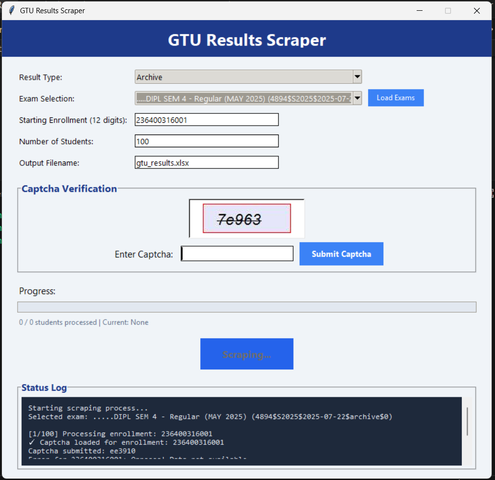

# 🎓 GTU Results Scraper

<div align="center">


**A modern, GUI-based automated scraper for GTU (Gujarat Technological University) student results**

[Features](#-features) • [Demo](#-demo) • [Installation](#%EF%B8%8F-installation) • [Usage](#-usage) • [Screenshots](#-screenshots)

</div>

---

## 📋 Overview

GTU Results Scraper is a Python-based desktop application with a modern Tkinter GUI that automates the process of collecting student result data from the GTU results portal. It handles captcha verification, processes multiple student records in batch, and exports data to Excel with summary statistics.

### ⚠️ Important Notice

> **This scraper is currently working as of January 2025, but may stop functioning in the future if the GTU results website changes its structure, implements additional security measures, or updates its captcha system. Use at your own discretion.**

---

## ✨ Features

- 🖥️ **Modern GUI Interface** - Clean, user-friendly Tkinter-based interface
- 🤖 **Automated Scraping** - Batch process multiple student records
- 🔐 **Captcha Handling** - Visual captcha display with manual input
- 📊 **Excel Export** - Structured data export with automatic summary statistics
- 🎯 **Smart Navigation** - Supports both Regular and Archive results
- 📈 **Progress Tracking** - Real-time progress bar and status logging
- 🔄 **Auto-Reset** - Form automatically resets after each scraping session
- 🌐 **Off-Screen Browser** - Browser runs invisibly in the background

---

## 🎬 Demo

### 📺 Video Walkthrough

[](https://youtu.be/U1ZTTVz2hCw)

> 👆 Click to watch the full demonstration video

---

## 🖼️ Screenshots

### GUI Interface

*Modern interface with captcha verification and real-time progress tracking*

### Excel Output

*Structured data with automatic summary statistics (MAX, MIN, AVG, Failed Students)*

---

## 🛠️ Tech Stack

| Technology | Purpose |
|------------|---------|
| **Python 3.8+** | Core programming language |
| **Selenium WebDriver** | Browser automation & web scraping |
| **Tkinter** | GUI framework |
| **Pandas** | Data manipulation & Excel export |
| **Pillow (PIL)** | Image processing for captcha display |
| **OpenPyXL** | Excel file handling |

---

## ⚙️ Installation

### Prerequisites

- Python 3.8 or higher
- Google Chrome browser (for Selenium WebDriver)
- Internet connection

### Steps

1. **Clone the repository**
   ```bash
   git clone https://github.com/maulik-0207/GTU-Result-Scraper.git
   cd GTU-Result-Scraper
   ```

2. **Create a virtual environment** (recommended)
   ```bash
   # Windows
   python -m venv venv
   venv\Scripts\activate

   # Linux / macOS
   python3 -m venv venv
   source venv/bin/activate
   ```

3. **Install dependencies**
   ```bash
   pip install -r requirements.txt
   ```

4. **Verify Chrome WebDriver**
   - Selenium Manager will automatically download the appropriate ChromeDriver
   - Ensure Google Chrome is installed on your system

---

## 🚀 Usage

### Running the Application

```bash
python main.py
```

### Step-by-Step Guide

1. **Select Result Type**
   - Choose between "Regular" or "Archive" results

2. **Load Exam Options**
   - Click "Load Exams" to fetch available exams from the GTU portal
   - Select your desired exam from the dropdown

3. **Enter Student Details**
   - **Starting Enrollment**: Enter the 12-digit enrollment number (e.g., `226400316220`)
   - **Number of Students**: Specify how many consecutive records to scrape
   - **Output Filename**: Choose your Excel output filename (default: `gtu_results.xlsx`)

4. **Start Scraping**
   - Click "Start Scraping"
   - Enter the captcha when prompted for each student
   - Monitor progress in real-time

5. **Review Results**
   - Check the generated Excel file
   - View summary statistics at the bottom of the sheet

---

## 📊 Output Format

The generated Excel file contains the following columns:

| Column | Description |
|--------|-------------|
| **Name** | Student's full name |
| **Enrollment_No** | 12-digit enrollment number |
| **Current_Sem_Back** | Current semester backlogs |
| **Total_Back** | Total backlogs across all semesters |
| **SPI** | Semester Performance Index |
| **CPI** | Cumulative Performance Index |
| **CGPA** | Cumulative Grade Point Average |

### Summary Statistics

Automatically appended at the end:
- **MAX** - Maximum values for all numeric columns
- **MIN** - Minimum values for all numeric columns
- **AVG** - Average values for all numeric columns
- **Total Failed Students** - Count of students with backlogs

---

## 🔧 Configuration

### Browser Settings

The scraper runs Chrome in off-screen mode by default. To modify browser behavior, edit the Chrome options in `main.py`:

```python
options = ChromeOptions()
options.add_argument("--window-size=960,1080")
options.add_argument("--window-position=-2000,0")  # Off-screen
options.add_argument("--disable-gpu")
```

### Captcha Settings

Captcha images are scaled 1.2x for better readability. Adjust in `display_captcha()` method:

```python
scale_factor = 1.2  # Modify this value (1.0 - 3.0)
```

---

## 🐛 Troubleshooting

### Common Issues

**Issue**: Browser doesn't open or crashes
- **Solution**: Update Chrome to the latest version, Selenium will auto-download matching ChromeDriver

**Issue**: Captcha not displaying
- **Solution**: Check internet connection and ensure the GTU website is accessible

**Issue**: "Incorrect captcha" errors
- **Solution**: Enter captcha carefully; the website may be case-sensitive

**Issue**: Excel file not generated
- **Solution**: Ensure you have write permissions in the project directory

---

## ⚠️ Disclaimer

This project is created **for educational and personal use only**.

- Web scraping may violate the terms of service of some websites
- Use responsibly and only with proper authorization
- The developers are not responsible for any misuse of this tool
- **The scraper may stop working if the GTU website structure changes**

---

## 📝 License

This project is licensed under the **MIT License** - see the [LICENSE](LICENSE) file for details.

---

## 👨‍💻 Author

**Maulik**

- GitHub: [@maulik-0207](https://github.com/maulik-0207)
- Repository: [GTU-Result-Scraper](https://github.com/maulik-0207/GTU-Result-Scraper)

---

## 🙏 Acknowledgments

- GTU (Gujarat Technological University) for providing the results portal
- Selenium WebDriver team for the automation framework
- Python community for excellent libraries

---

<div align="center">

**⭐ Star this repository if you found it helpful!**

Made with ❤️ by [Maulik](https://github.com/maulik-0207)

</div>